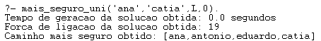
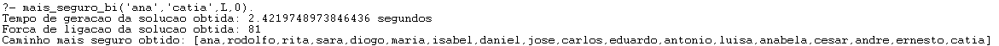
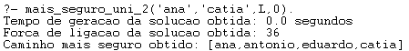
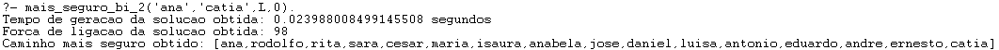

# Determinar O Caminho Mais Seguro
====================================================

# Problema

* **Descrição:** Determinar o **caminho mais seguro** (garante que **não há uma força de ligação inferior a x** considerando as forças nos dois sentidos da ligação) para determinado utilizador.

# Predicados

## Caminho Mais Seguro Só No Sentido Da Travessia

### Unidirecional
```pl
mais_seguro_uni(Orig, Dest, CaminhoMaisSeguro, M) :-
        get_time(Ti),                                                                     
        (melhor_caminho_mais_seguro_uni(Orig, Dest,M) ; true),                              
        retract(melhor_sol_mais_segura(CaminhoMaisSeguro, Forca)),                   
        get_time(Tf),                                                                     
        T is Tf-Ti,                                                                       
        write('Tempo de geracao da solucao obtida: '), write(T), write(' segundos'), nl,
        write('Forca de ligacao da solucao obtida: '), write(Forca), nl,
        write('Caminho mais seguro obtido: '), write(CaminhoMaisSeguro), nl,!.

melhor_caminho_mais_seguro_uni(Orig, Dest,M) :-
        asserta(melhor_sol_mais_segura(_, -1000)),                          
        dfsMaisSeguroUni(Orig, Dest, LCaminho, Forca,M),
        atualiza_melhor_mais_seguro(LCaminho, Forca),
        fail.                                                                   

atualiza_melhor_mais_seguro(LCaminho, Forca) :-
        melhor_sol_mais_segura(_, F),
        Forca > F, retract(melhor_sol_mais_segura(_,_)),                   
        asserta(melhor_sol_mais_segura(LCaminho, Forca)).                  

dfsMaisSeguroUni(Orig, Dest, Cam, Forca, M) :- dfsMaisSeguroUni2(Orig, Dest, [Orig], Cam, Forca, M).

dfsMaisSeguroUni2(Dest, Dest, LA, Cam, 0, _) :- !, reverse(LA, Cam).

dfsMaisSeguroUni2(Act, Dest, LA, Cam, Forca, M) :-
        no(NAct, Act, _),                                                       
        ligacao(NAct, NX, F1, _),
        F1 >= M,                 
        no(NX, X, _),                                                           
        \+ member(X, LA),                                                       
        dfsMaisSeguroUni2(X, Dest, [X|LA], Cam, FX, M),                             
        Forca is (FX + F1).
```

* **Explicação:** Vão sendo encontrados os caminhos seguros, ou seja, caminhos em que não existe uma ligação inferior a ```M``` (```ligacao(NAct, NX, F1, _),F1 >= M```) e vai se calculando ao mesmo tempo a sua força total (```Forca is (FX + F1)```). Sempre que se encontra um caminho seguro (```dfsMaisSeguroUni(Orig, Dest, LCaminho, Forca,M)```) vai se verificar se esse caminho é mais seguro que o atual mais seguro e caso seja verdade é atualizado o caminho mais seguro para esse (```melhor_sol_mais_segura(_, F),Forca > F, retract(melhor_sol_mais_segura(_,_)), asserta(melhor_sol_mais_segura(LCaminho, Forca)).```). No final teremos assim o caminho mais seguro e sua respetiva força total.

* **Exemplo:**
> 

*	**Estudo da complexidade do problema da determinação dos caminhos:**

|Nº de camadas intermédias (sem nó 1 e 200) | Nº de nós por camada | Tempo para gerar a solução com menor nº de ligações |
|------------------------------------------ |--------------------- |---------------------------------------------------- |
| 1                                         | 1                    | 0.0s                                                |
| 2                                         | 2                    | 0.0s                                                |
| 3                                         | 3                    | 0.0s                                                |
| 4                                         | 4                    | 0.0s                                                |

* ***Nota:*** Foi considerada a ligação mínima de 0.

### Bidirecional
```pl
mais_seguro_bi(Orig, Dest, CaminhoMaisSeguro, M) :-
        get_time(Ti),                                                                     
        (melhor_caminho_mais_seguro_bi(Orig, Dest,M) ; true),                              
        retract(melhor_sol_mais_segura(CaminhoMaisSeguro, Forca)),                   
        get_time(Tf),                                                                     
        T is Tf-Ti,                                                                       
        write('Tempo de geracao da solucao obtida: '), write(T), write(' segundos'), nl,
        write('Forca de ligacao da solucao obtida: '), write(Forca), nl,
        write('Caminho mais seguro obtido: '), write(CaminhoMaisSeguro), nl,!.

melhor_caminho_mais_seguro_bi(Orig, Dest,M) :-
        asserta(melhor_sol_mais_segura(_, -1000)),                          
        dfsMaisSeguroBi(Orig, Dest, LCaminho, Forca,M),
        atualiza_melhor_mais_seguro(LCaminho, Forca),
        fail.                                                                   

dfsMaisSeguroBi(Orig, Dest, Cam, Forca, M) :- dfsMaisSeguroBi2(Orig, Dest, [Orig], Cam, Forca, M).

dfsMaisSeguroBi2(Dest, Dest, LA, Cam, 0, _) :- !, reverse(LA, Cam).

dfsMaisSeguroBi2(Act, Dest, LA, Cam, Forca, M) :-
        no(NAct, Act, _),                                                       
        (ligacao(NAct, NX, F1, _);ligacao(NX, NAct, F1, _)),
        F1 >= M,                 
        no(NX, X, _),                                                           
        \+ member(X, LA),                                                       
        dfsMaisSeguroBi2(X, Dest, [X|LA], Cam, FX, M),                             
        Forca is (FX + F1).
```

* **Explicação:** A diferença do Bidirecional para o Unidirecional anterior é que neste são consideradas as ligações em ambos os sentidos e para isso é preciso acrescentar uma disjunção (```(ligacao(NAct, NX, F1, _);ligacao(NX, NAct, F1, _))```) no predicado ```dfsMaisSeguroBi2```.

* **Exemplo:**
> 

*	**Estudo da complexidade do problema da determinação dos caminhos:**

|Nº de camadas intermédias (sem nó 1 e 200) | Nº de nós por camada | Tempo para gerar a solução com menor nº de ligações |
|------------------------------------------ |--------------------- |---------------------------------------------------- |
| 1                                         | 1                    | 0.0s                                                |
| 2                                         | 2                    | 0.0s                                                |
| 3                                         | 3                    | 0.002s                                              |
| 4                                         | 4                    | 9.0s                                                |

* ***Nota:*** Foi considerada a ligação mínima de 0.

## Caminho Mais seguro considerando a soma das duas forças em cada ramo da travessia e garantindo que em nenhuma delas temos uma força abaixo de um dado limiar

### Unidirecional
```pl
mais_seguro_uni_2(Orig, Dest, CaminhoMaisSeguro, M) :-
        get_time(Ti),                                                                     
        (melhor_caminho_mais_seguro_uni_2(Orig, Dest,M) ; true),                              
        retract(melhor_sol_mais_segura(CaminhoMaisSeguro, Forca)),                   
        get_time(Tf),                                                                     
        T is Tf-Ti,                                                                       
        write('Tempo de geracao da solucao obtida: '), write(T), write(' segundos'), nl,
        write('Forca de ligacao da solucao obtida: '), write(Forca), nl,
        write('Caminho mais seguro obtido: '), write(CaminhoMaisSeguro), nl,!.

melhor_caminho_mais_seguro_uni_2(Orig, Dest,M) :-
        asserta(melhor_sol_mais_segura(_, -1000)),                          
        dfsMaisSeguroUni_2(Orig, Dest, LCaminho, Forca,M),
        atualiza_melhor_mais_seguro(LCaminho, Forca),
        fail.                                                                                                                                                          

dfsMaisSeguroUni_2(Orig, Dest, Cam, Forca, M) :- dfsMaisSeguroUni2_2(Orig, Dest, [Orig], Cam, Forca, M).

dfsMaisSeguroUni2_2(Dest, Dest, LA, Cam, 0, _) :- !, reverse(LA, Cam).

dfsMaisSeguroUni2_2(Act, Dest, LA, Cam, Forca, M) :-
        no(NAct, Act, _),                                                       
        ligacao(NAct, NX, F1, F2),
        F1 >= M,
        F2 >= M,                 
        no(NX, X, _),                                                           
        \+ member(X, LA),                                                       
        dfsMaisSeguroUni2_2(X, Dest, [X|LA], Cam, FX, M),                             
        Forca is (FX + F1 + F2).
```

* **Explicação:** Vão sendo encontrados os caminhos seguros, ou seja, caminhos em que não existe uma ligação inferior a ```M``` em ambos os sentidos (```ligacao(NAct, NX, F1, F2),F1 >= M,F2 >= M```) e vai se calculando ao mesmo tempo a sua força total (```Forca is (FX + F1 + F2)```). Sempre que se encontra um caminho seguro (```dfsMaisSeguroUni_2(Orig, Dest, LCaminho, Forca,M)```) vai se verificar se esse caminho é mais seguro que o atual mais seguro e caso seja verdade é atualizado o caminho mais seguro para esse (```  melhor_sol_mais_segura(_, F),Forca > F, retract(melhor_sol_mais_segura(_,_)), asserta(melhor_sol_mais_segura(LCaminho, Forca)).```). No final teremos assim o caminho mais seguro e sua respetiva força total.

* **Exemplo:**
> 

*	**Estudo da complexidade do problema da determinação dos caminhos:**

|Nº de camadas intermédias (sem nó 1 e 200) | Nº de nós por camada | Tempo para gerar a solução com menor nº de ligações |
|------------------------------------------ |--------------------- |---------------------------------------------------- |
| 1                                         | 1                    | 0.0s                                                |
| 2                                         | 2                    | 0.0s                                                |
| 3                                         | 3                    | 0.0s                                                |
| 4                                         | 4                    | 0.0s                                                |

* ***Nota:*** Foi considerada a ligação mínima de 0.

## Bidirecional
```pl
mais_seguro_bi_2(Orig, Dest, CaminhoMaisSeguro, M) :-
        get_time(Ti),                                                                     
        (melhor_caminho_mais_seguro_bi_2(Orig, Dest,M) ; true),                              
        retract(melhor_sol_mais_segura(CaminhoMaisSeguro, Forca)),                   
        get_time(Tf),                                                                     
        T is Tf-Ti,                                                                       
        write('Tempo de geracao da solucao obtida: '), write(T), write(' segundos'), nl,
        write('Forca de ligacao da solucao obtida: '), write(Forca), nl,
        write('Caminho mais seguro obtido: '), write(CaminhoMaisSeguro), nl,!.

melhor_caminho_mais_seguro_bi_2(Orig, Dest,M) :-
        asserta(melhor_sol_mais_segura(_, -1000)),                          
        dfsMaisSeguroBi_2(Orig, Dest, LCaminho, Forca,M),
        atualiza_melhor_mais_seguro(LCaminho, Forca),
        fail.                                                                                                                                                          

dfsMaisSeguroBi_2(Orig, Dest, Cam, Forca, M) :- dfsMaisSeguroBi2_2(Orig, Dest, [Orig], Cam, Forca, M).

dfsMaisSeguroBi2_2(Dest, Dest, LA, Cam, 0, _) :- !, reverse(LA, Cam).

dfsMaisSeguroBi2_2(Act, Dest, LA, Cam, Forca, M) :-
        no(NAct, Act, _),                                                       
        (ligacao(NAct, NX, F1, F2);ligacao(NX,NAct, F1, F2)),
        F1 >= M,
        F2 >= M,                 
        no(NX, X, _),                                                           
        \+ member(X, LA),                                                       
        dfsMaisSeguroBi2_2(X, Dest, [X|LA], Cam, FX, M),                             
        Forca is (FX + F1 + F2).
```

* **Explicação**: A diferença do Bidirecional para o Unidirecional anterior é que neste são consideradas as ligações em ambos os sentidos e para isso é preciso acrescentar uma disjunção (```(ligacao(NAct, NX, F1, F2);ligacao(NX,NAct, F1, F2))```) no predicado ```dfsMaisSeguroBi2_2```.

* **Exemplo:**
> 

*	**Estudo da complexidade do problema da determinação dos caminhos:**

|Nº de camadas intermédias (sem nó 1 e 200) | Nº de nós por camada | Tempo para gerar a solução com menor nº de ligações |
|------------------------------------------ |--------------------- |---------------------------------------------------- |
| 1                                         | 1                    | 0.0s                                                |
| 2                                         | 2                    | 0.0s                                                |
| 3                                         | 3                    | 0.0s                                                |
| 4                                         | 4                    | 0.08s                                               |

* ***Nota:*** Foi considerada a ligação mínima de 0.

# Respostas às Perguntas

* 1. O nº de soluções dependerá só do nº de nós?

> **R:** Não, dependerá também do **número de ligações**. Por exemplo, se tivermos **4 nós com 1 ligação cada** teremos apenas **1 caminho** e se tivermos **1 nó com 5 ligações** teremos **5 caminhos**.

* 2. O nº de soluções dependerá só do nº de ligações?

> **R:**  Não, dependerá também do **número de nós**. Por exemplo, se tivermos **1 nó com 2 ligações**
teremos **2 caminhos** e se tivermos **2 nós com 2 ligações** teremos **4 caminhos**.

# Ficheiro Base de Conhecimentos

* O Ficheiro da Base de Conhecimentos relativo ao **Determinar O Caminho Mais Seguro** é o [Caminho_Mais_Seguro_Sprint_B_1190633](Caminho_Mais_Seguro_Sprint_B_1190633.pl)
