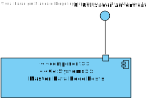
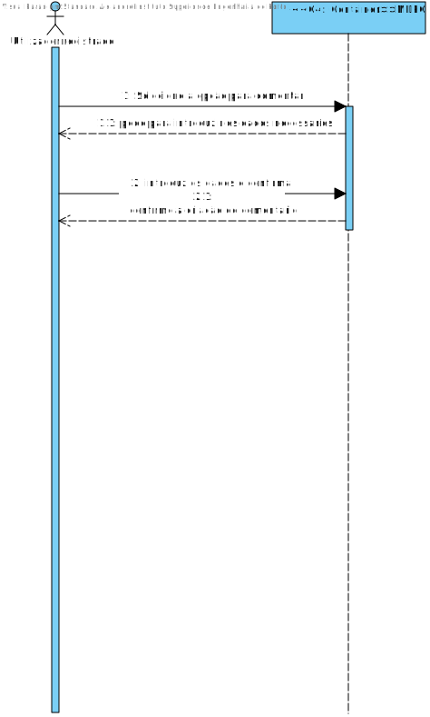

# UC 14 - Criar Post
=================================================================

---

# Nível 1 - Vista Lógica

# Nível 1 - Vista de cenário

---

# Nível 2 - Vista Lógica

# Nível 2 - Vista de Processo

# Nível 2 - Vista de Implementação

# Nível 2 - Vista Física

---

# Nível 3 - Vista Lógica

# Nível 3 - Vista de Processo

# Nível 3 - Vista de Implementação

---
#  Criar Comentario
=================================================================

---

# Nível 1 - Vista Lógica

# Nível 1 - Vista de cenário

---

# Nível 2 - Vista Lógica

# Nível 2 - Vista de Processo

# Nível 2 - Vista de Implementação

# Nível 2 - Vista Física

---

# Nível 3 - Vista Lógica

# Nível 3 - Vista de Processo

# Nível 3 - Vista de Implementação

