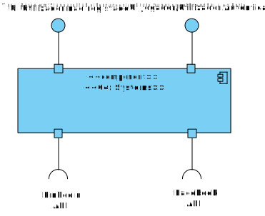
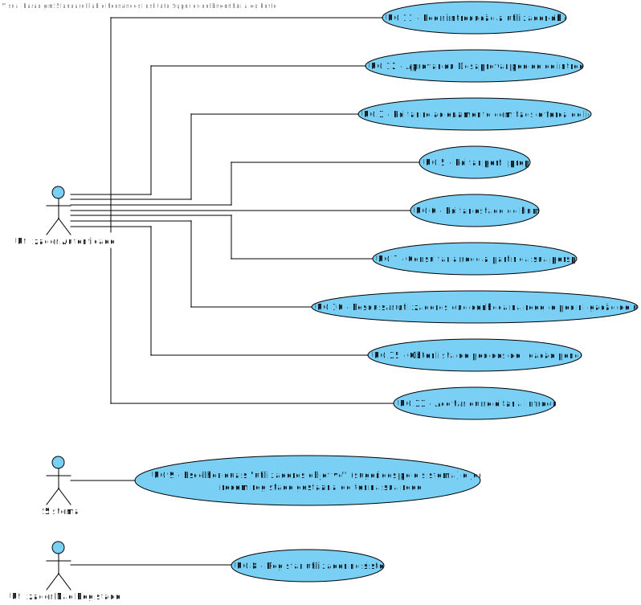

# Projeto - Social Network Game
---

# Nível 1 - Vista Lógica

# Nível 1 - Vista de cenário

---

# Nível 2 - Vista Lógica

# Nível 2 - Vista de Processos

# Nível 2 - Vista de Implementação

# Nível 2 - Vista Física

---
