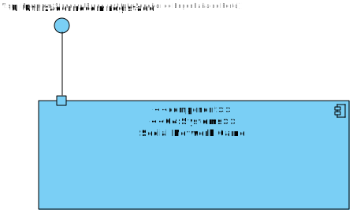
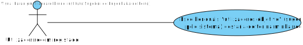
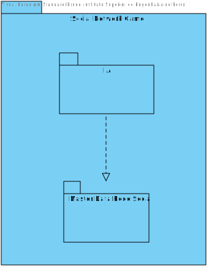
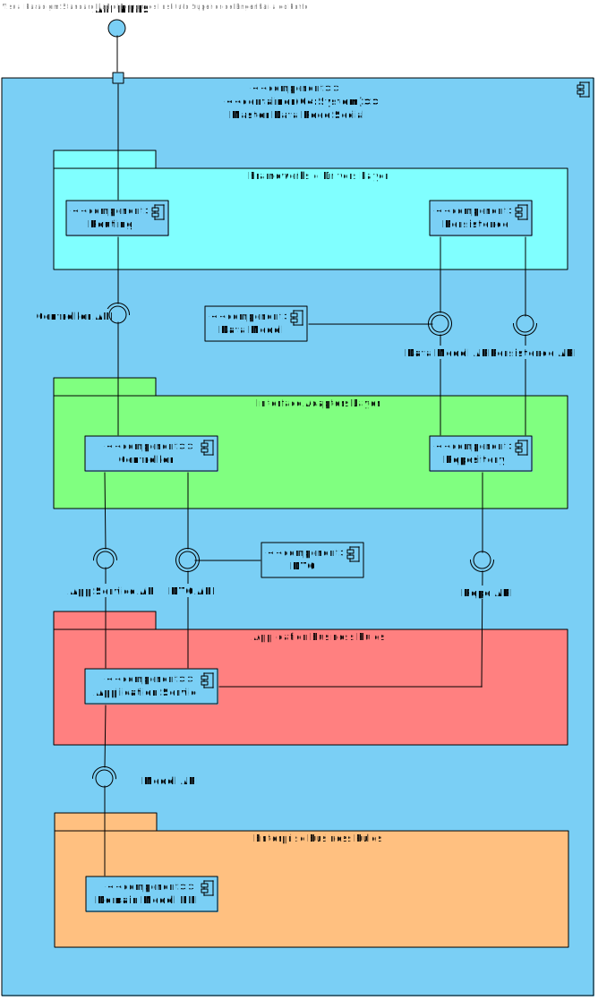
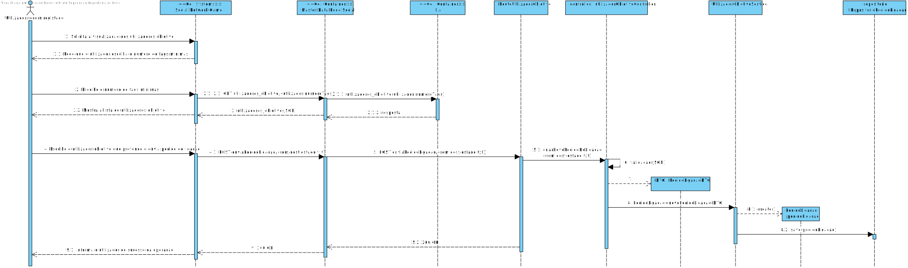
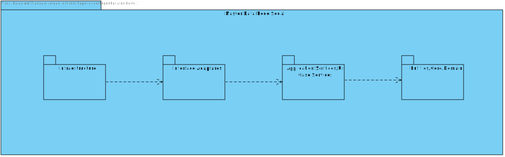

# UC9 - "Utilizador Objetivo"
=================================================================

# Design Arquitetural

## Nível 1

### Nível 1 - Vista Lógica

> 

### Nível 1 - Vista de Cenários

> 

## Nível 2

## Nível 2 - Vista Lógica

> 

## Nível 2 - Vista de Processo

> 

## Nível 2 - Vista de Implementação

> 

## Nível 2 - Vista Física

> 

## Nível 3 (Master Data Rede)

## Nível 3 - Vista Lógica

> 

## Nível 3 - Vista de Processo

> 

## Nível 3 - Vista de Implementação

> 
