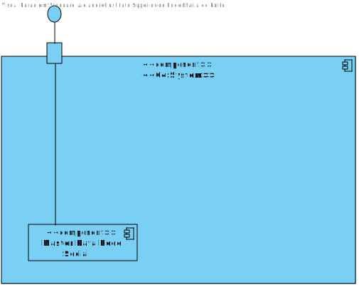
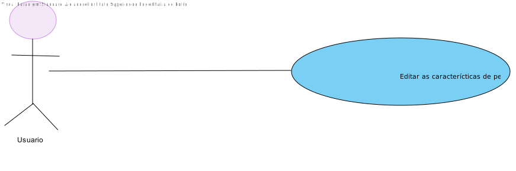
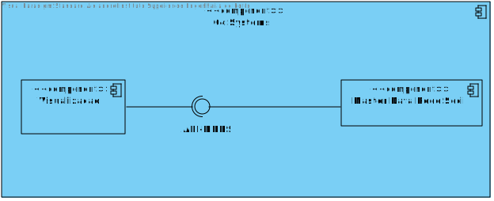
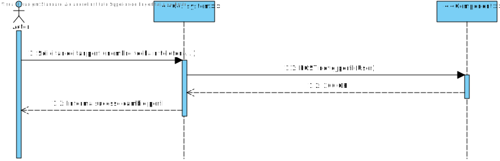
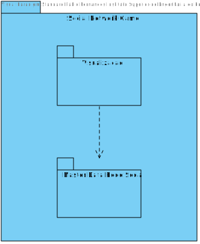
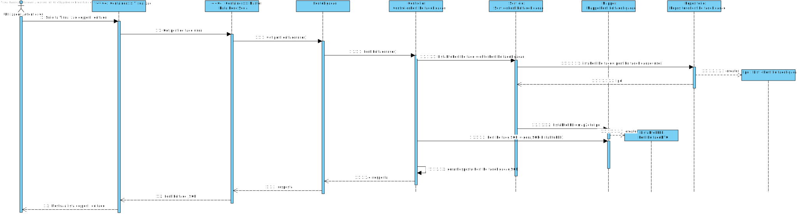

# UC5 - Editar perfil própio
=================================================================

# Design Arquitetural

## Nível 1

### Nível 1 - Vista Lógica

### Nível 1 - Vista de Cenários

## Nível 2

## Nível 2 - Vista Lógica

## Nível 2 - Vista de Processo

## Nível 2 - Vista de Implementação

## Nível 2 - Vista Física

---

## Nível 3 (Master Data Rede)

## Nível 3 - Vista Lógica

## Nível 3 - Vista de Processo

## Nível 3 - Vista de Implementação

